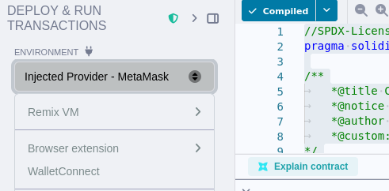
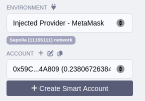
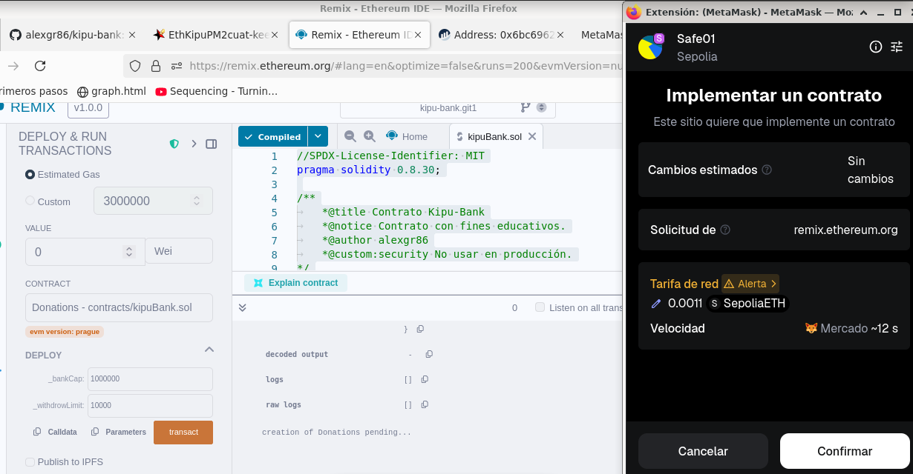

# kipu-bank

## Contract Information
### Contract address
`0x6bc69624f55b3cef49b069e809ec8576991573ab`
[Kipu-Bank - smart contract](https://sepolia.etherscan.io/address/0x6bc69624f55b3cef49b069e809ec8576991573ab#code)

## Description
This is a smart contract that functions as a bank. Any user can deposit and withdraw ETH according to the rules established in the contract.
While it is intended for educational purposes, it serves as an approximation of a bank implementation using smart contracts.

## Rules
- Any user (a wallet with an address) can deposit into the bank

- Only the owner of the account (each address used to deposit) can withdraw their own ETH

- There is a maximum amount that can be withdrawn per transaction

- There is a maximum limit on how much the bank can store

## Contract Interaction

### Functions

#### deposit:
The wallet can deposit funds as long as it does not exceed the global limit defined in the contract.

#### withdrawValue:
The wallet can withdraw its previously deposited ETH, as long as it does not exceed the maximum amount allowed per transaction.

#### getBalance:
Allows the wallet to check its current account balance in KipuBank.

#### getBankCap:
This function allows checking the maximum limit that the contract can store.

#### getWithdrawLimit: 
Maximum amount allowed per withdrawal.

## Steps Deploy

1. Select the network to deploy

2. Verify that the selected network is correct

3. Sign with the selected provider

3. Obtain contract address
